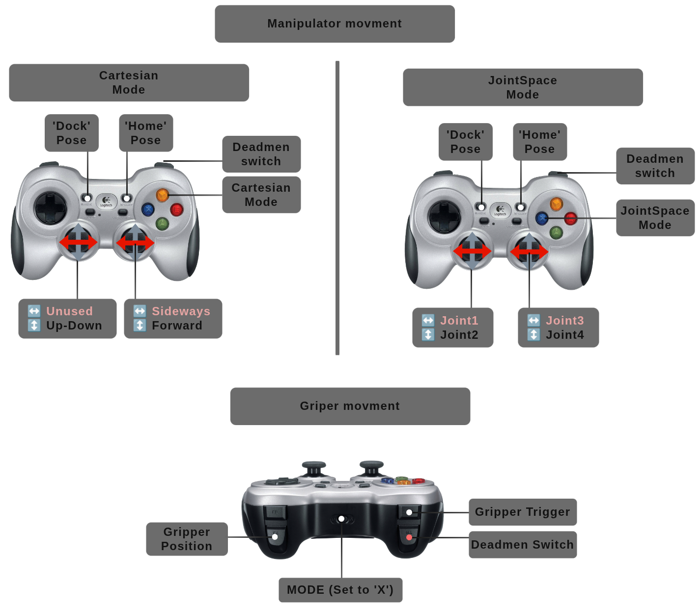
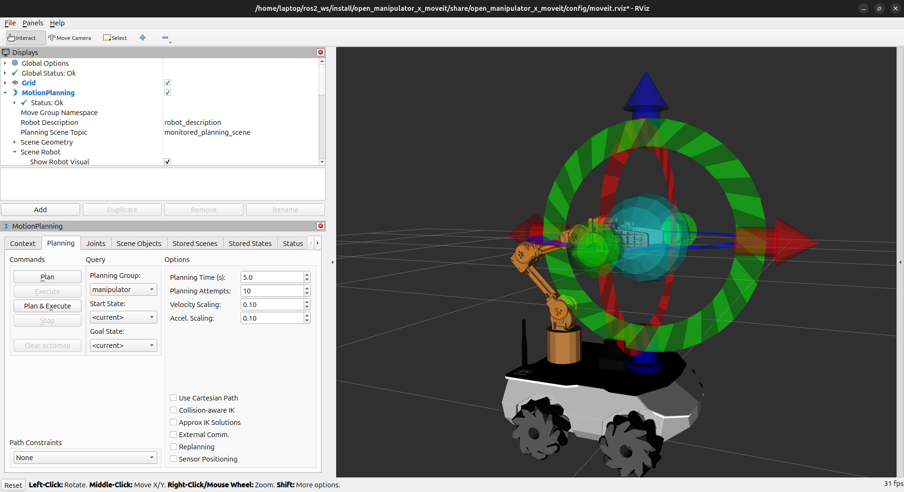

# ROSbot XL Manipulation

> [!WARNING]
> **Limitations**
>
> 1. **Before starting driver!** Make sure the manipulator is **undock**, manipulator is **away from a collision** (does not rest on robot objects) and **joints are away from its position limits** (e.g. one of the joints is started from extreme position).
> 2. Controlling MoveIt and via the joystick are two independent processes. You should not send commands to both of these services at the same time.
> 3. When the power supply is lost, the robot loses momentum and falls by inertia. Therefore, you should hold the manipulator when the power is cut off, or call the docking node `ros2 launch rosbot_moveit dock.launch.py` (pass `namespace:=$ROBOT_NAMESPACE` when the robot was launched in a namespace so `dock` reaches the namespaced `move_group`) or press `RT` + `Back` buttons on gamepad. The launch wrapper injects `robot_description_kinematics` etc. so the `MoveGroupInterface` inside `dock` does not log `No kinematics plugins defined`; the executable can still be run bare with `ros2 run rosbot_moveit dock --ros-args -r __ns:=/$ROBOT_NAMESPACE` if you only need a quick test.
> 4. The manipulator does not analyze collisions with the antenna, to improve the range of the manipulator's movements. It's good practice to position the antenna horizontally on the physical robot.
> 5. In the event of overload, loss of communication or sudden stopping of the manipulator process (e.g. during reboot), some joints may not receive the command to stop operation. This may prevent re-establishing communication. In such a case, it will be necessary to **reset the power supply**.

Below is a handful of the most important information for the ROSbot Manipulation/Manipulation PRO package.

## Activation

By default, the arm remains in an idle state after the driver is launched. To activate it, execute:

```bash
sudo rosbot.arm-activate # if you are using snap
ros2 run rosbot_controller arm_control active # if you are using local build
```

You can change the driver's default behavior using the `arm_activate` argument.

## Control

After starting, the manipulator should be in the Home position after a few seconds. Now you can control ROSbot XL and OpenMANIPULATOR-X using a gamepad or RViz.

> [!NOTE]
> The instructions presented are for the Jazzy version. You can check the difference in versions by changing the branch in the [rosbot_ros/MANIPULATOR.MD](https://github.com/husarion/rosbot_ros/blob/jazzy/MANIPULATOR.md) repository.

### Gamepad

After running the ROSbot XL Manipulation Package, you should be able to control the manipulator. The easiest way to move the manipulator is to connect a gamepad and steer the robot. The graphic below shows how to steer the manipulator using a gamepad.



Drive controls (`cmd_vel`) are configured in [`rosbot_joy/config/config.yaml`](rosbot_joy/config/config.yaml). Manipulator gamepad mappings are hardcoded in [`rosbot_moveit/src/joy2servo.cpp`](rosbot_moveit/src/joy2servo.cpp) (`enum Axis` / `enum Button`).

Everything below runs **only while the dead-man trigger `RT` is held** (right trigger ≤ -0.3).

#### Mode toggle

| Button | Mode | Behaviour |
|---|---|---|
| **Y** | `Cartesian` **(default)** — XYZ in EE frame | `joy2servo` integrates stick velocity (`cartesian_linear_velocity` param, default `0.1 m/s`) into a target EE pose, runs KDL position-only IK in-process, and publishes the resulting joint velocities as **JointJog**. The IK is done in joy2servo because `moveit_servo`'s POSE/TWIST paths run a singularity guard on the full 6×N Jacobian which trips on any 4-DoF pose (see [moveit_msgs#185](https://github.com/moveit/moveit_msgs/issues/185)); the JointJog path does not run that guard. |
| **X** | `JointSpace` — per-joint | Each stick axis drives one joint directly. No IK. Useful as a low-level fallback for joints unreachable in Cartesian (e.g. joint4 wrist when EE is at limit). |

Both modes publish on `servo_node/delta_joint_cmds`. X / Y are XOR-ed — pressing both at once is a no-op.

#### JOINT_JOG axis map

| Stick | Joint |
|---|---|
| Left stick X | `joint1` |
| Left stick Y | `joint2` |
| Right stick X | `joint3` |
| Right stick Y | `joint4` (inverted: stick up = joint up) |

#### Cartesian axis map (delta interpreted in EE frame)

Each tick joy2servo reads the current EE pose, adds `stick * cartesian_linear_velocity * dt` in EE frame, runs KDL position-only IK on the result, and publishes the resulting joint velocities as JointJog. Sign convention: stick up / right = positive.

| Stick | Direction |
|---|---|
| Right stick Y | ±X (stick up = arm extends forward) |
| Right stick X | ±Y (stick right = sideways across the gripper) |
| Left stick Y | ±Z (stick up = perpendicular-up to the gripper) |
| Left stick X | unused |

Releasing the stick zeroes the joint velocities — the arm stops immediately at the current pose. IK failures (out-of-reach targets) are logged and skipped silently.

#### Combo actions (work in both modes)

| Combo | Action |
|---|---|
| `RT + Back` | Move to **Dock** pose (gripper Close → arm Dock, planned via OMPL through `MoveGroupInterface`) |
| `RT + Start` | Move to **Home** pose (arm Home → gripper Open) |
| `RT + RB` + `LT axis` | Analogue gripper — `LT` axis maps to `gripper_left_joint` position (`-0.009 m` … `+0.015 m`) |

#### Tunable parameters

```bash
ros2 run rosbot_moveit joy2servo --ros-args \
  -p cartesian_linear_velocity:=0.2 \
  -p cartesian_step_dt:=0.05 \
  -p cartesian_max_joint_velocity:=1.0
```

- `cartesian_linear_velocity` (m/s, default `0.1`) — EE linear speed when a stick is at full deflection
- `cartesian_step_dt` (seconds, default `0.05`) — per-tick integration step; should be ≥ servo's `publish_period` and ≈ joy autorepeat period (default `1/20 Hz = 0.05`)
- `cartesian_max_joint_velocity` (rad/s, default `1.0`) — uniform cap on the joint velocities produced by Cartesian-mode IK. Applied as a single scaling factor so the EE direction is preserved (just slower). Bounds how far the arm can travel per `collision_check_rate` tick — without it, KDL IK "branch jumps" near singularities can produce multi-rad/s spikes that overshoot `self_collision_proximity_threshold` before the collision check updates.

You may have noticed that the movement of the manipulator is slow, and the full capabilities of the manipulator are not fully utilized. This is a safety precaution to ensure that the collision checker effectively prevents the manipulator from bumping into the robot.
The dynamic limits of the manipulator have been tuned in order to provide a reliable collision prevention mechanism. While this setup should cover most situations, there is still a possibility of accidental contact with the robot or its sensors. Therefore, we advise you to remain aware of this potential risk when operating the manipulator.

### RViz Moveit

To move the manipulator using RViz, you need to build the code first. Then run:

```bash
ros2 launch rosbot_moveit rviz.launch.py
```

After that, RViz with the Moveit configuration will appear.



It is also possible to control the manipulator in the RViz using the *MotionPlanning* plugin. You can move the end effector by dragging the green marker and then click the `Plan & Execute` button to make the manipulator execute the motion. You may notice that the end effector doesn't follow the marker exactly, and to get Z rotation you have to use the blue ring - this is due to insufficient degrees of freedom of the manipulator, which causes some of the configurations to not be achievable.

> [!TIP]
> If you're not able to move the end effector in the Rviz, make sure that you have enabled the *Approx IK Solutions* option.
> If the manipulator moves too slowly, you can increase *Velocity Scaling* and *Accel. Scaling* up to `1.0`.

## Helpful Resources

### Resetting the Manipulator

In some situations it may be necessary to manually move the manipulator out of an invalid configuration.
To do it, first you will have to disable the torque of the manipulator, for example using the service.
On your ROSbot XL execute. **Hold the manipulator** while doing it, as it disables the torque and the manipulator can fall.

```bash
sudo rosbot.arm-disactivate # if you are using snap
ros2 run rosbot_controller arm_control inactive # if you are using local build
```

Now you can manually move the manipulator to the desired position and launch:

```bash
sudo rosbot.arm-activate # if you are using snap
ros2 run rosbot_controller arm_control active # if you are using local build
```

### Modifications

For more advanced purpose you may want to change default **manipulator position** or edit dynamixel **servo setting**. To do this it will be necessary to build [`rosbot_ros`](https://github.com/husarion/rosbot_ros/) and for:

1. Manipulator position
   - change position of the manipulator in the [`rosbot_xl.urdf.xacro`](https://github.com/husarion/rosbot_ros/blob/jazzy/rosbot_description/urdf/rosbot_xl.urdf.xacro)
   - regenerate collision matrix using [MoveIt Setup Assistant](https://moveit.picknik.ai/main/doc/examples/setup_assistant/setup_assistant_tutorial.html)

2. Servo setting
   Check/change some servo parameters in [Dynamixel Wizard 2.0](https://emanual.robotis.com/docs/en/software/dynamixel/dynamixel_wizard2/).

### Troubleshooting

- **Gripper does not move** - it could be caused by the wrong initial position. Turn off the torque as described in the [**Resetting the manipulator**](/tutorials/ros-projects/rosbot-xl-openmanipulator-x/#resetting-the-manipulator). Now manually rotate the hub of the manipulator servo 180 degrees (if the connecting rod of the left finger was below the right finger's one, the hub should be rotated so that it is above). Now once again launch controllers.
- **Manipulator stopped moving** - it can be too close to collision or singularity (you can verify it by examining console logs). The easiest solution to this problem is to return the manipulator to the *Home* position (`RT` + `Start` button).
- **Manipulator stopped moving and *Start* button does not work** - if the manipulator still won't move, it could be already in the collision (you can verify it by examining console logs). In this case, follow the [**Resetting the manipulator**](/tutorials/ros-projects/rosbot-xl-openmanipulator-x/#resetting-the-manipulator) step and return it manually to some valid position. If nothing helps try restart power supply.
