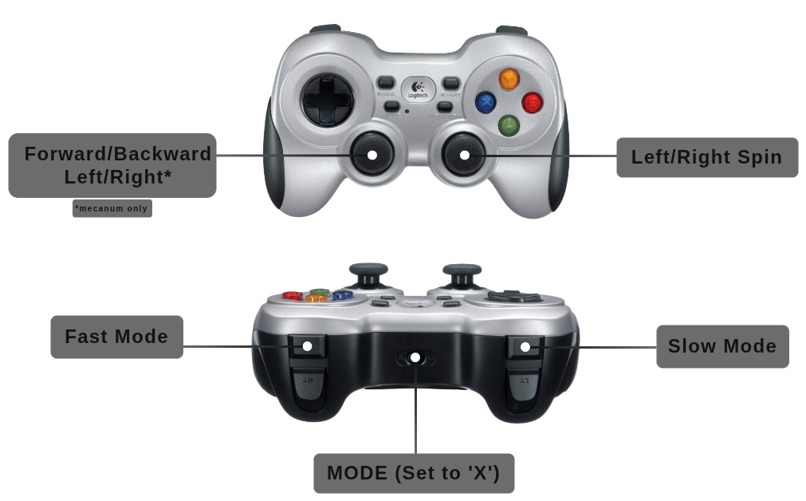

# ROSbot Series - Software

Detailed information about content of rosbot package for ROS2.

## Control

### Gamepad

After running the ROSbot XL Manipulation Package, you should be able to control the manipulator. The easiest way to move the manipulator is to connect a gamepad and steer the robot. The graphic below shows how to steer the manipulator using a gamepad.

Drive controls (`cmd_vel`) are defined in [`rosbot_joy/config/config.yaml`](rosbot_joy/config/config.yaml). The manipulator gamepad mappings (XL only) are hardcoded in [`rosbot_moveit/src/joy2servo.cpp`](rosbot_moveit/src/joy2servo.cpp).

## ROS API

### Namespace policy

Everything below is published under `/<namespace>/` when the `namespace`
launch arg (or `ROBOT_NAMESPACE` env) is set. Intentional globals:

- `/tf`, `/tf_static` — bridged via [tf_namespace_bridge](https://github.com/husarion/tf_namespace_bridge).
- `/parameter_events`, `/rosout` — ROS 2 infra.
- `/clock` — sim only.

Hard-coded, no runtime opt-out. HW uses `push_ros_namespace`, sim uses URDF
`<remapping>` for the `controller_manager` surface — see
[Namespacing and multirobot](ARCHITECTURE.md#5-namespacing-and-multirobot).
Enforced by
[test_namespace_isolation.py](rosbot_bringup/test/test_namespace_isolation.py).

### Available Nodes

[controller_manager/controller_manager]: https://github.com/ros-controls/ros2_control/blob/master/controller_manager
[diff_drive_controller/diff_drive_controller]: https://github.com/ros-controls/ros2_controllers/tree/master/diff_drive_controller
[gz_ros2_control/gz_ros2_control]: https://github.com/ros-controls/gz_ros2_control
[imu_sensor_broadcaster/imu_sensor_broadcaster]: https://github.com/ros-controls/ros2_controllers/tree/master/imu_sensor_broadcaster
[joint_state_broadcaster/joint_state_broadcaster]: https://github.com/ros-controls/ros2_controllers/tree/master/joint_state_broadcaster
[robot_localization/ekf_node]: https://github.com/cra-ros-pkg/robot_localization
[robot_state_publisher/robot_state_publisher]: https://github.com/ros/robot_state_publisher
[rosbot_hardware_interfaces/rosbot_imu_sensor]: https://github.com/husarion/rosbot_hardware_interfaces/blob/main/src/rosbot_imu_sensor.cpp
[rosbot_hardware_interfaces/rosbot_system]: https://github.com/husarion/rosbot_hardware_interfaces/blob/main/src/rosbot_system.cpp
[ros_gz_bridge/parameter_bridge]: https://github.com/gazebosim/ros_gz/tree/ros2/ros_gz_bridge

| 🤖  | 🖥️  | NODE                          | DESCRIPTION                                                                                                                                                                                                                                                                                                                                         |
| --- | --- | ----------------------------- | --------------------------------------------------------------------------------------------------------------------------------------------------------------------------------------------------------------------------------------------------------------------------------------------------------------------------------------------------- |
| ✅  | ✅  | **`controller_manager`**      | Controller Manager performs two main functions. First, it manages controllers and their required interfaces, handling tasks like loading, activating, deactivating, and unloading. Second, it interacts with hardware components, ensuring access to their interfaces.   _[controller_manager/controller_manager]_                             |
| ✅  | ✅  | **`differential_drive_controller`** / **`mecanum_drive_controller`**  | The controller managing a mobile robot with a differential or omni drive (mecanum wheels). Converts speed commands for the robot body to wheel commands for the base. It also calculates odometry based on hardware feedback and shares it.`DiffDriveController` or `MecanumDriveController`   _[diff_drive_controller/diff_drive_controller]_ |
| ✅  | ✅  | **`ekf_node`**                | Used to fuse wheel odometry and IMU data. Parameters are defined in `rosbot_localization/config/config.yaml`   _[robot_localization/ekf_node]_                                                                                                                                                                                                         |
| ❌  | ✅  | **`/gz_bridge`**              | Transmits Gazebo simulation data to the ROS layer   _[ros_gz_bridge/parameter_bridge]_                                                                                                                                                                                                                                         |
| ❌  | ✅  | **`gz_ros_control`**         | Responsible for integrating the ros2_control controller architecture with the Gazebo simulator.   _[gz_ros2_control/gz_ros2_control]_                                                                                                                                                                                                                                         |
| ✅  | ✅  | **`imu_broadcaster`**         | The broadcaster to publish readings of IMU sensors   _[imu_sensor_broadcaster/imu_sensor_broadcaster]_                                                                                                                                                                                                                                         |
| ✅  | ❌  | **`imu_sensor_node`**         | The node responsible for subscriptions to IMU data from the hardware   _[rosbot_hardware_interfaces/rosbot_imu_sensor]_                                                                                                                                                                                                                        |
| ✅  | ✅  | **`joint_state_broadcaster`** | The broadcaster reads all state interfaces and reports them on specific topics   _[joint_state_broadcaster/joint_state_broadcaster]_                                                                                                                                                                                                           |
| ✅  | ✅  | **`robot_state_publisher`**   | Uses the URDF specified by the parameter robot\*description and the joint positions from the topic joint\*states to calculate the forward kinematics of the robot and publish the results using tf   _[robot_state_publisher/robot_state_publisher]_                                                                                             |
| ✅  | ❌  | **`rosbot_system_node`**      | The node communicating with the hardware responsible for receiving and sending data related to engine control   _[rosbot_hardware_interfaces/rosbot_system]_                                                                                                                                                                                   |
| ❌  | ✅  | **`rosbot_gz_bridge`**        | Transmits data about the robot between the Gazebo simulator and ROS.   _[ros_gz_bridge/parameter_bridge]_ |
| ✅  | ❌  | **`rosbot_mcu`**             | Microcontroller unit (MCU) communication node. Default: `rosbot_mavlink_bridge` (MAVLink). With `backend:=microros` it is replaced by the `micro_ros_agent` node, which speaks XRCE-DDS to the MCU instead.   _[rosbot_mavlink_bridge/rosbot_mavlink_bridge]_                                                                                                                                                                                                                      |

### Available Topics

[control_msgs/DynamicJointState]: https://github.com/ros-controls/control_msgs/blob/master/control_msgs/msg/DynamicJointState.msg
[diagnostic_msgs/DiagnosticArray]: https://docs.ros.org/en/jazzy/p/diagnostic_msgs/msg/DiagnosticArray.html
[geometry_msgs/PoseWithCovarianceStamped]: https://docs.ros.org/en/jazzy/p/geometry_msgs/msg/PoseWithCovarianceStamped.html
[geometry_msgs/TwistStamped]: https://docs.ros.org/en/jazzy/p/geometry_msgs/msg/TwistStamped.html
[nav_msgs/Odometry]: https://docs.ros.org/en/jazzy/p/nav_msgs/msg/Odometry.html
[sensor_msgs/Imu]: https://docs.ros.org/en/jazzy/p/sensor_msgs/msg/Imu.html
[sensor_msgs/JointState]: https://docs.ros.org/en/jazzy/p/sensor_msgs/msg/JointState.html
[sensor_msgs/Joy]: https://docs.ros.org/en/jazzy/p/sensor_msgs/msg/Joy.html
[sensor_msgs/LaserScan]: https://docs.ros.org/en/jazzy/p/sensor_msgs/msg/LaserScan.html
[std_msgs/String]: https://docs.ros.org/en/jazzy/p/std_msgs/msg/String.html
[tf2_msgs/TFMessage]: https://docs.ros.org/en/jazzy/p/tf2_msgs/msg/TFMessage.html

| 🤖  | 🖥️  | TOPIC                                          | DESCRIPTION                                                                                                                   |
| --- | --- | ---------------------------------------------- | ----------------------------------------------------------------------------------------------------------------------------- |
| ✅  | ✅  | **`cmd_vel`**                                  | Sends velocity commands for controlling robot motion (`use_stamped_vel: true`).   _[geometry_msgs/TwistStamped]_         |
| ✅  | ✅  | **`diagnostics`**                              | Contains diagnostic information about the robot's systems.   _[diagnostic_msgs/DiagnosticArray]_                         |
| ✅  | ✅  | **`dynamic_joint_states`**                     | Publishes information about the dynamic state of joints.   _[control_msgs/DynamicJointState]_                            |
| ✅  | ✅  | **`imu/data`**                      | Broadcasts IMU (Inertial Measurement Unit) data.   _[sensor_msgs/Imu]_                                                   |
| ✅  | ✅  | **`joint_states`**                             | Publishes information about the state of robot joints. On hardware the `effort` field carries wheel motor torque (measured on ROSbot XL rev 1.2, back-EMF estimate otherwise); in simulation `effort` is `NaN`.   _[sensor_msgs/JointState]_                                      |
| ✅  | ✅  | **`joy`**                             | Publishes joystick input data.   _[sensor_msgs/Joy]_                                      |
| ✅  | ✅  | **`odometry/filtered`**                        | Publishes filtered odometry data.   _[nav_msgs/Odometry]_                                                                |
| ✅  | ✅  | **`odometry/wheels`**              | Provides odometry data from the base controller of the ROSbot XL.   _[nav_msgs/Odometry]_                                |
| ✅  | ✅  | **`robot_description`**                        | Publishes the robot's description.   _[std_msgs/String]_                                                                 |
| ✅  | ✅  | **`scan`**                                     | Publishes raw laser scan data.   _[sensor_msgs/LaserScan]_                                                               |
| ✅  | ✅  | **`set_pose`**                                 | Changes the robot's `odometry/filtered` pose.   _[geometry_msgs/PoseWithCovarianceStamped]_                                     |
| ✅  | ✅  | **`tf`**                                       | Publishes transformations between coordinate frames over time.   _[tf2_msgs/TFMessage]_                                  |
| ✅  | ✅  | **`tf_static`**                                | Publishes static transformations between coordinate frames.   _[tf2_msgs/TFMessage]_                                     |

There are also additional topics related with the ROSbot firmware. For more information about them, please refer to the [ROSbot Firmware documentation](https://github.com/husarion/rosbot-firmware/blob/jazzy/ROS_API.md).

### Available Services

[std_srvs/SetBool]: https://docs.ros.org/en/jazzy/p/std_srvs/srv/SetBool.html

| 🤖  | 🖥️  | SERVICE                | DESCRIPTION                                                                                                                                                                |
| --- | --- | ---------------------- | -------------------------------------------------------------------------------------------------------------------------------------------------------------------------- |
| ✅  | ❌  | **`led_strip/enable`** | ROSbot XL only. Enables (`data: true`) or disables (`data: false`) the LED strip animation. While disabled the `led_strip_manager` node neither computes nor publishes the `led_strip` image.   _[std_srvs/SetBool]_ |

## Packages

One-line purpose per package; full detail (launch flows, internals) in
[ARCHITECTURE.md](ARCHITECTURE.md#2-packages).

| Package | Description |
| --- | --- |
| [`rosbot`](rosbot/) | Meta-package — pins sibling repos via `*.repos`, no code. |
| [`rosbot_bringup`](rosbot_bringup/) | Hardware entry point: per-model bringup + MCU backend (MAVLink default / micro-ROS). _Local-only._ |
| [`rosbot_controller`](rosbot_controller/) | ros2_control setup — spawns drive, IMU and joint-state controllers (plus the manipulator on XL). |
| [`rosbot_description`](rosbot_description/) | URDF/xacro for hardware and simulation, robot configurations, `robot_state_publisher`. |
| [`rosbot_gazebo`](rosbot_gazebo/) | Gazebo simulation launch and robot spawning. _Local-only._ |
| [`rosbot_hardware_interfaces`](rosbot_hardware_interfaces/) | C++ ros2_control plugins (`RosbotSystem`, `RosbotImuSensor`) — the firmware ABI. |
| [`rosbot_joy`](rosbot_joy/) | Joystick teleop for driving (`joy_node` + `teleop_twist_joy`). |
| [`rosbot_localization`](rosbot_localization/) | EKF fusing wheel odometry + IMU → `odometry/filtered`. |
| [`rosbot_moveit`](rosbot_moveit/) | MoveIt manipulation for the OpenMANIPULATOR-X (XL only) — see [MANIPULATOR.md](MANIPULATOR.md). |
| [`rosbot_utils`](rosbot_utils/) | Utilities: firmware flashing, robot configuration, udev rules, battery alert, LED strip. |
